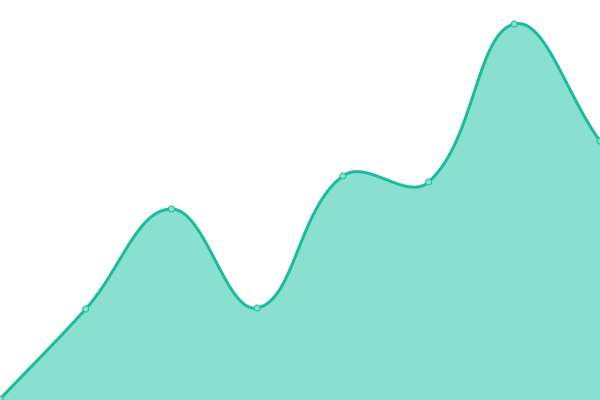
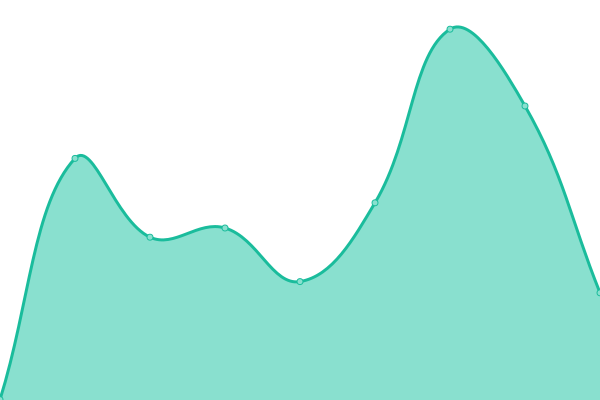

# [📈 Live Status](https://RbtsEvrwhr-Riley.github.io/upmonitor): <!--live status--> **🟧 Partial outage**

This repository contains the open-source uptime monitor and status page for [Riley August](https://RbtsEvrwhr-Riley.github.io/upmonitor), powered by [Upptime](https://github.com/upptime/upptime).

With [Upptime](https://upptime.js.org), you can get your own unlimited and free uptime monitor and status page, powered entirely by a GitHub repository. We use [Issues](https://github.com/RbtsEvrwhr-Riley/upmonitor/issues) as incident reports, [Actions](https://github.com/RbtsEvrwhr-Riley/upmonitor/actions) as uptime monitors, and [Pages](https://RbtsEvrwhr-Riley.github.io/upmonitor) for the status page.

<!--start: status pages-->
<!-- This summary is generated by Upptime (https://github.com/upptime/upptime) -->
<!-- Do not edit this manually, your changes will be overwritten -->
<!-- prettier-ignore -->
| URL | Status | History | Response Time | Uptime |
| --- | ------ | ------- | ------------- | ------ |
|  [MainSite](https://www.robots-everywhere.com) | 🟥 Down | [main-site.yml](https://github.com/RbtsEvrwhr-Riley/upmonitor/commits/HEAD/history/main-site.yml) | 

 0ms
     
 | 

<a href="https://RbtsEvrwhr-Riley.github.io/upmonitor/history/main-site">0.00%</a>
    

|  [CellSol](https://www.f3.to/cellsol) | 🟩 Up | [cell-sol.yml](https://github.com/RbtsEvrwhr-Riley/upmonitor/commits/HEAD/history/cell-sol.yml) | 

 589ms
     
 | 

<a href="https://RbtsEvrwhr-Riley.github.io/upmonitor/history/cell-sol">100.00%</a>
    

<!--end: status pages-->

[**Visit our status website →**](https://RbtsEvrwhr-Riley.github.io/upmonitor)

## 📄 License

- Powered by: [Upptime](https://github.com/upptime/upptime)
- Code: [MIT](./LICENSE) © [Riley August](https://RbtsEvrwhr-Riley.github.io/upmonitor)
- Data in the `./history` directory: [Open Database License](https://opendatacommons.org/licenses/odbl/1-0/)
